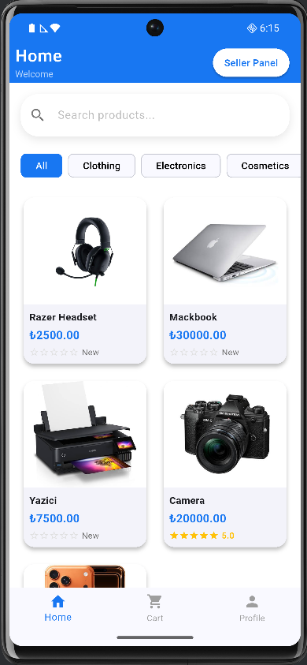
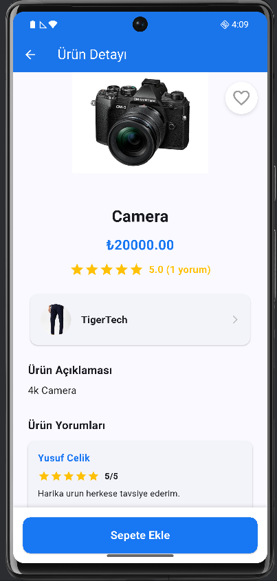
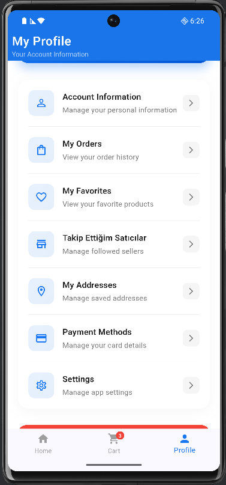
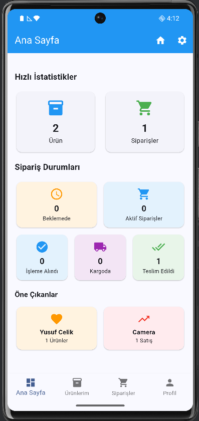
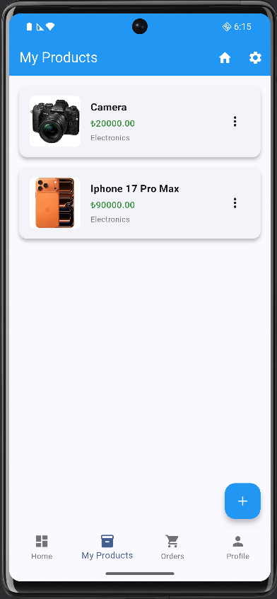
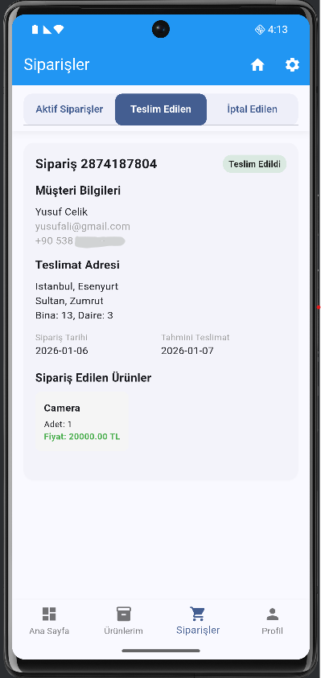
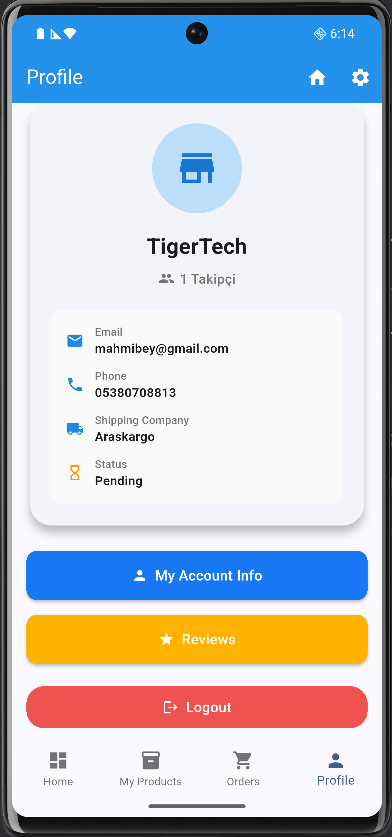

# Full-Stack E-Commerce Platform

A production-ready, full-stack e-commerce application developed with a focus on scalability, security, and maintainability.  
The project includes a complete buyer–seller ecosystem, a robust backend architecture, and a multilingual mobile client.

---

## Overview

This project is a fully functional e-commerce platform where users and sellers interact through products, orders, and reviews.  
It is designed with real-world scenarios in mind, including authentication, authorization, validation, error handling, and internationalization.

The application has been developed over several months and reflects advanced business logic and system complexity, while remaining open for future improvements and extensions.

---

## Screenshots

## 📱 User Experience
<table>
  <tr>
    <td align="center">
       
      <b>Home Page</b>
    </td>
    <td align="center">
       
      <b>Product Details</b>
    </td>
    <td align="center">
       
      <b>Cart</b>
    </td>
    <td align="center">
       
      <b>User Profile</b>
    </td>
  </tr>
</table>
&nbsp;

## 🛒 Seller Panel
<table>
  <tr>
    <td align="center">
       
      <b>Dashboard & Statistics</b>
    </td>
    <td align="center">
       
      <b>Product Management</b>
    </td>
    <td align="center">
       
      <b>Order Management</b>
    </td>
    <td align="center">
       
      <b>Seller Profile</b>
    </td>
  </tr>
</table>

---

## Tech Stack

### Frontend
- **Flutter** (Dart)
- State management
- Client-side validation
- Multilingual UI support (TR / EN / AR)

### Backend
- **FastAPI** (core backend and RESTful API)
- Pydantic-based request and response validation
- RESTful API design
- Email and password-based authentication with secure password hashing and role-based access control

### Database
- **PostgreSQL**
- Relational schema design
- User–Seller–Order–Product relationships
- Migrations and indexing

### Third-Party Services
- **Twilio** (phone number verification via SMS)
- **Google Mail (SMTP)** for email verification

---

## Security & Validation

- Secure **password hashing**
- Server-side and client-side validation
- Authentication & authorization checks
- Protected routes and restricted access for unauthenticated users
- Robust error handling and defensive programming for edge cases

---

## Internationalization

The application supports three languages:
- Turkish
- English
- Arabic

Language switching is available within the application, ensuring a localized user experience.

---

## Core Features

### User Features
- User registration and authentication
- Email & phone number verification
- User profile management
- Product browsing and seller-specific store pages
- Order placement and order status tracking
- Product reviews and ratings
- Restricted access to checkout and sensitive pages for unauthenticated users

### Seller Features
- Seller profile management
- Product creation and management
- Viewing product reviews and ratings
- Order status updates
- Sales statistics and order insights

---

## Error Handling

The system includes comprehensive error handling mechanisms for:
- Authentication & authorization failures
- Validation errors
- Business logic edge cases
- Unexpected runtime issues

While bugs can always occur, the application is built to gracefully handle failures and provide meaningful feedback.

---

## Future Improvements

Although the project has reached a solid and advanced state, potential future enhancements include:
- Payment provider integrations
- Advanced analytics and reporting
- Notification services
- Performance optimizations
- Additional language support

---

## Disclaimer
This project goes beyond a typical demo application and is designed to reflect real-world e-commerce workflows and system complexity.
